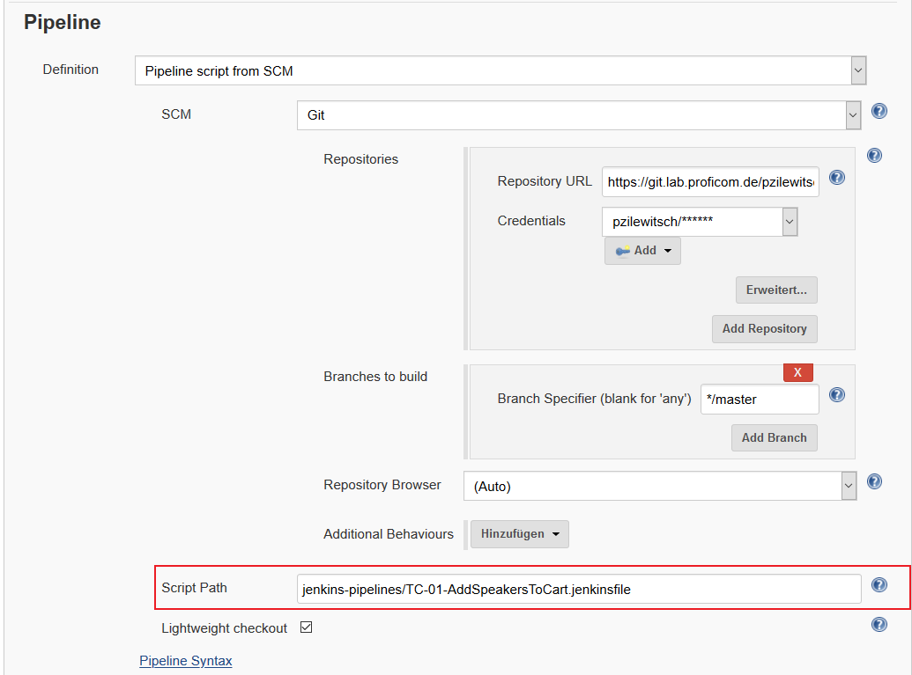

# Offizielles Selenium Beispielprojekt

Beispielprojekt aus der Arbeitsgruppe Business Development Selenium

## Built With

* [Java](https://www.java.com/de/download/) - Programmiersprache
* [Maven](https://maven.apache.org/) - Build Management
* [Selenium](https://selenium.dev/) - Framework zum automatisierten Steuern eines WebBrowsers
* [TestNG](https://testng.org/doc/) - Unit Test Framework
* [ExtentReports](http://extentreports.com/) - Reporting Framework

Die aktuellen Versionen der einzelnen Komponenten sind in der [pom.xml](pom.xml) zu finden

## Getting Started

### Voraussetzungen

Java muss auf der jeweiligen Ausführungsumgebung eingerichtet sein.

Da das Dependency Management erfolgt, sollte sichergestellt werden, dass Maven auf der jeweiligen Ausführungsumgebung
eingerichtet ist.

Sollten Testfälle lokal ausgeführt werden, müssen die Browser Mozilla Firefox und Google Chrome installiert sein.

### Installation

Zum Herunterladen aller notwendigen Dependencies bitte folgenden Maven-Befehl ausführen:

```
mvn clean install -DskipTests
```

### Parameter

* driverType - gibt an, welcher WebDriver verwendet werden soll (und damit auch welcher Browser)
* environment - URL zu der Application Under Test
* suiteXmlFile - gibt an, welche TestSuite ausgeführt werden soll

Der Parameter **driverType** kann folgende Werte annehmen:

* CHROME - lokaler WebDriver für Google Chrome
* FIREFOX - lokaler WebDriver für Mozilla Firefox
* CHROME-REMOTE - RemoteWebDriver für die Ausführung über einen Selenium Hub -> Chrome Node
* FIREFOX-REMOTE - RemoteWebDriver für die Ausführung über einen Selenium Hub -> Firefox Node

Sollte der Parameter keinen Wert haben, wird ein lokaler Firefox-Driver verwendet.

Hinweis: Das Erzeugen der WebDriver instanzen erfolgt mit Hilfe
eines [WebDriverManager](https://github.com/bonigarcia/webdrivermanager)

-----

### Ausführung in einer Entwicklungsumgebung (IntelliJ Beispiel)

Run Test suites:

Edit configurations anclicken:


TestNg wählen und eine Name geben und auch "Suites" in Type wählen


Wählen Sie aus der Suite den Sie ausführen wollen


Dann "Apply wählen"


Dann ausführen


-----

### Ausführung über die Kommandozeile

```
mvn clean test -DdriverType="CHROME" -Denvironment="http://advantage.proficom.de:8080/#/" -DsuiteXmlFile="testsuites/advantageshop/TC-01-AddSpeakersToCart.xml"
```

Führt die TestSuite "TC-01-AddSpeakersToCart" mit einem lokalen Chrome WebDriver gegen die DemoAdvantageShop Anwendung
aus.

-----

### Ausführung über Jenkins

Im Ordner 'jenkins-pipelines' befinden sich für alle Testfälle die jeweilige .jenkinsfile-Datei. Diese kann in Jenkins
referenziert werden, um die Ausführung über das jeweilige Pipeline-Script zu steuern:



**Achtung**

Solltet ihr dieses Projekt weiterentwickeln und in einem neuen Repository hinterlegen, müssen die .jenkinsfile-Dateien
entsprechend angepasst werden.

**Reporting**

Um die TestReports in Jenkins anzeigen zu lassen, muss folgendes Plugin installiert
werden: [HTML Publisher](https://plugins.jenkins.io/htmlpublisher)

Damit die Reports im Jenkins korrekt angezeigt werden (css & javascript), ist es notwendig, folgenden Befehl über die
Jenkins Skript-Konsole auszuführen:

```
System.setProperty("hudson.model.DirectoryBrowserSupport.CSP", "");
```

Diese Einstellung wird nach einem Neustart von Jenkins verworfen. Die permanente Lösung sieht so aus, dass in der
Konfigurationsdatei von Jenkins folgendes argument bei den JAVA_OPTIONS hinzugefügt werden muss:

```
-Dhudson.model.DirectoryBrowserSupport.CSP= 
```

(CentOS: /etc/sysconfig/jenkins | Windows: C:\Program Files\Jenkins\jenkins.xml)

-----

### Maven Archetype

Im [Nexus](https://nexus.lan.proficom.de/) ist
ein [Selenium Maven Archetype](https://nexus.lan.proficom.de/#browse/browse:maven-snapshots:de%2Fproficom%2Fselenium)
abgelegt, mit dem in wenigen Schritten ein Selenium-Projekt erstellt werden kann.

Ein Maven Archetype ist ein Projekt-Template zur Erstellung neuer Projekte. Es enthält im allgemeinen eine pom.xml und
weitere grundlegende Dateien. Der Selenium Archetype enthält eine pom.xml, die alle notwendigen Dependencies für
Selenium enthält sowie ein paar Beispiel-Dateien für Tests und Pageobjects auf deren Grundlage man aufbauen kann.

**Verwendung des Archetype**

Um den Archetype verwenden zu können muss man zuerst den profi.com Nexus als Repository in den Maven settings.xml
aufnehmen. Die Datei liegt üblicherweise unter `<USER_HOME>/.m2/settings.xml`.

Ein Beispiel befindet sich in [archetype/settings.xml](archetype/settings.xml).

**Neues Projekt über Kommandozeile erstellen**

Schritt 1: Um ein neues Projekt aus dem Archetype zu erstellen kann auf der Kommandozeile folgender Befehl verwendet
werden.

``` 
mvn archetype:generate -DarchetypeGroupId="de.proficom" -DarchetypeArtifactId="selenium"
```

Schritt 2: Jetzt muss noch die groupId (z.B. de.proficom) und artifactId (z.B. test) für das neue Projekt angegeben
werden. Die restlichen Werte können auf Default gelassen werden.

```
Define value for property 'groupId': de.proficom
Define value for property 'artifactId': test
Define value for property 'version' 1.0-SNAPSHOT: :
Define value for property 'package' de.proficom: :
Confirm properties configuration:
groupId: de.proficom
artifactId: test
version: 1.0-SNAPSHOT
package: de.proficom
Y: :
```

Schritt 3: Es wird ein neues Verzeichnis mit der Bezeichnung der artifactId angelegt und die Projektdateien erstellt.
Wechselt man in das Verzeichnis, so können dort mit 'mvn test' die Beispieltests ausgeführt werden.

**Neues Projekt in IntelliJ erstellen**

Schritt 1: `File > New > Project`

Schritt 2: `Typ Maven > Checkbox "Create from archetype"` anklicken und Archetype `de.proficom:selenium` auswählen


Schritt 3: Im weiteren Verlauf die groupId und artifactId angeben. Der Rest kann auf Default bleiben. Unter Ausführung
des Goals 'test' kann auch hier der Beispieltest gestartet werden.

-----

### Selenium Grid (statisch)

http://172.16.20.6:4444/grid/console

## Team

Paul Zilewitsch, Franz Nolasco